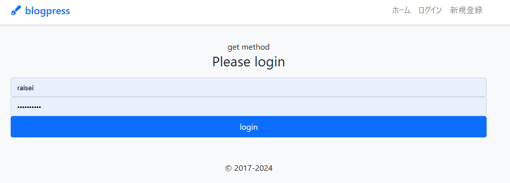
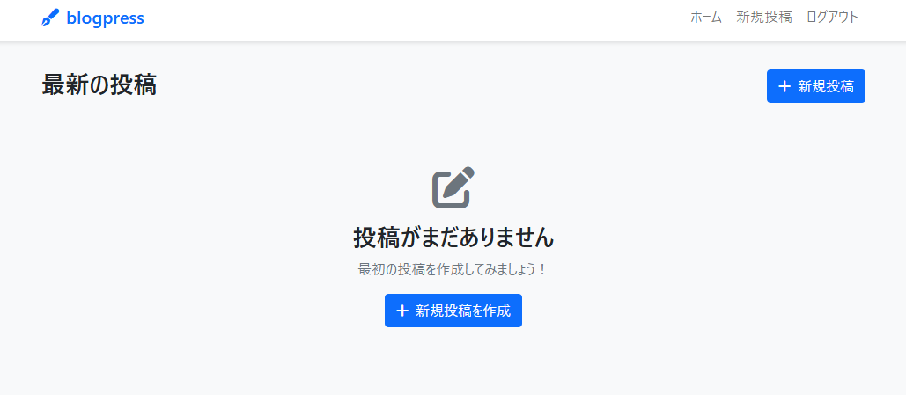
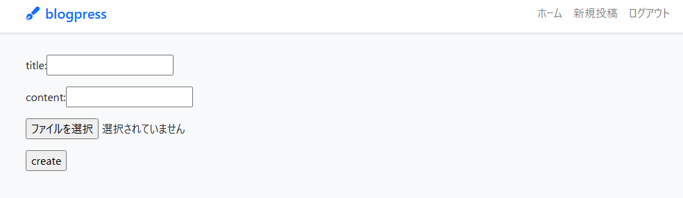
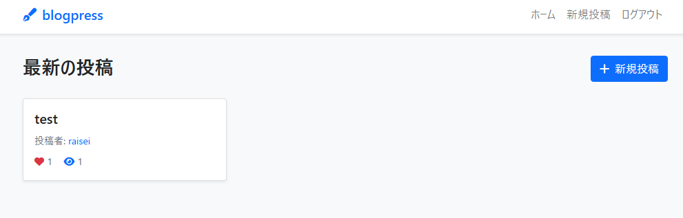
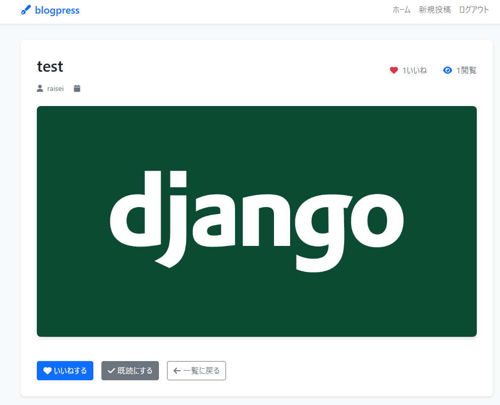

# BlogPress App

## 目次
- [概要](#概要)
- [制作背景](#制作背景)
- [技術スタック](#技術スタック)
- [技術選定](#技術選定)
- [主な機能](#主な機能)
- [使用方法](#使用方法)
- [セットアップ手順](#セットアップ手順)
- [こだわりポイント](#こだわりポイント)
- [管理画面](#管理画面)
- [注意事項](#注意事項)

## 概要

blogpressは、Djangoフレームワークを使用して開発したWebベースのブログアプリケーションです。ユーザーがアカウントを作成し、記事の投稿・閲覧・管理を行うことができる学習用プロジェクトです。

## 制作背景

### 課題
- Django フレームワークの基本概念（MVTパターン）を体系的に学習する必要があった
- ユーザー認証システムやデータベース操作など、実際のWebアプリケーション開発で必要な機能の実装経験が不足していた
- 単一機能だけでなく、複数のアプリケーションを統合したプロジェクト開発の経験が必要だった

### 目的
- DjangoのMVT（Model-View-Template）パターンの理解と実装
- セキュアなユーザー認証システムの構築方法の習得
- データベース設計とDjango ORMの活用スキルの向上
- フロントエンドとバックエンドの連携方法の学習
- 複数アプリケーション間での責務分離と統合の実践

## 技術スタック

- **Backend**: Django
- **Database**: SQLite
- **Frontend**: HTML, CSS, Bootstrap
- **Python**: 3.8.10


## 技術選定

### Django
**選定理由**: 学習効率とセキュリティを重視
- ユーザー認証システムが標準装備されており、セキュアな実装を短期間で学習可能
- 自動生成される管理画面により、CRUD操作の学習に集中できる
- MVTパターンによる明確な責務分離で、Webアプリケーションの基本構造を理解しやすい

### SQLite
**選定理由**: 学習環境での利便性を優先
- ファイルベースでゼロコンフィグ、環境構築の複雑さを排除
- Django ORMの学習に集中でき、後に他のDBへの移行も容易
- 学習過程でのデータ永続化とトランザクション機能を提供

### Bootstrap
**選定理由**: UI開発の学習コストを抑制
- レスポンシブデザインを効率的に実現
- 統一感のあるUIコンポーネントで、デザインよりも機能実装の学習に集中
- ブラウザ互換性が保証されており、フロントエンド学習の障壁を軽減

## 主な機能

**ブログアプリ（blogapp）**
- 記事の作成、編集、削除
- 記事の一覧表示・詳細表示
- いいね機能・既読数表示

**アカウント管理（accounts）**
- ユーザー登録・ログイン・ログアウト
- プロフィール管理
- 認証状態によるアクセス制御

## 使用方法
### デモ動画


### 1. ログイン画面

未ログイン状態で`/list`にアクセスすると、以下のログイン画面が表示されます。  
初回利用時はアカウントの作成が必要です。既存のアカウントを持っている場合は、ユーザー名とパスワードを入力してログインボタンをクリックしてください。セキュリティのため、パスワードは暗号化されて管理されています。


### 2. メモ一覧表示
#### 初期状態（投稿なし）
ログイン後、初回アクセス時やまだ投稿が作成されていない場合は、以下のような画面が表示されます：

- 画面上部には「blogpress」のロゴとナビゲーション（ホーム、新規投稿、ログアウト）が配置されています
- メイン画面には「最新の投稿」というタイトルの下に投稿作成を促すメッセージが表示されます
- 中央には編集アイコンと「投稿がまだありません」のメッセージが表示され、その下に「最初の投稿を作成してみましょう！」という案内文があります
- 「新規投稿を作成」ボタンが配置されており、クリックすることで投稿作成画面に遷移できます
- 右上の「新規投稿」ボタンからも同様に投稿作成が可能です


#### 投稿作成フォーム

「新規投稿を作成」ボタンをクリックすると、投稿作成フォームが表示されます：

- **title（タイトル）フィールド**: 投稿のタイトルを入力するテキストボックス
- **content（内容）フィールド**: 投稿の本文を入力するテキストエリア
- **ファイル選択機能**: 「ファイルを選択」ボタンで画像やファイルを添付可能（現在は「選択されていません」の状態）
- **createボタン**: 入力内容を保存して投稿を作成するボタン



#### 投稿一覧表示（投稿あり）


投稿が作成されると、メイン画面に以下のように表示されます：

- **投稿カード**: 各投稿がカード形式で表示されます
- **投稿タイトル**: 「test」などの投稿タイトルが表示されます
- **投稿者情報**: 「投稿者: raisei」のように投稿したユーザー名が表示されます
- **インタラクション機能**:
  - ❤️ アイコンと数字：「いいね」機能で、現在の「いいね」数が表示されます
  - 👁️ アイコンと数字：既読機能で、投稿を読んだユーザー数が表示されます
- **新規投稿ボタン**: 右上に「新規投稿」ボタンが配置され、いつでも新しい投稿を作成できます


### 3. メモ詳細表示
各メモをクリックすることで、詳細画面を確認できます。  
詳細画面では、メモの完全な内容を読むことができます。また、「いいね」と「既読」の機能があり、クリックすると一覧画面に表示される数字が増加します。これにより、他のユーザーとのインタラクションが可能となり、人気のメモや既読状況を共有できます。ログアウト機能も用意されており、使用後は安全にセッションを終了できます。



## セットアップ手順

### 1. リポジトリのクローン

```bash
git clone https://github.com/Raisei-Ito/blogpress-app-practice.git
cd blogpress-app-practice
```

### 2. 仮想環境の作成と有効化
wslを使用したので、macos,linuxを使用していないwindowsユーザーは[こちらのリポジトリ](https://github.com/Raisei-Ito/Compiler_installation_wsl)を確認
```bash
# 仮想環境の作成
python3 -m venv venv

# 仮想環境の有効化
# Windows
venv\Scripts\activate
# macOS/Linux
source venv/bin/activate
```

### 3. 依存関係のインストール

```bash
# Djangoのインストール
pip install django

# その他必要なパッケージがある場合
# pip install -r requirements.txt
```

### 4. データベースのセットアップ

```bash
# マイグレーションファイルの作成
python3 manage.py makemigrations

# データベースにマイグレーションを適用
python3 manage.py migrate
```

### 5. スーパーユーザーの作成（オプション）

```bash
python3 manage.py createsuperuser
```

### 6. 開発サーバーの起動

```bash
python3 manage.py runserver
```

ブラウザで `http://127.0.0.1:8000/` にアクセスしてアプリケーションを確認できます。


## こだわりポイント

### 1. ユーザーインタラクション機能の実装
単純なブログ機能だけでなく、「いいね」と「既読」機能を追加しました。これにより、読者とのエンゲージメントを可視化し、人気記事の把握が可能になります。

### 2. アクセス制御の徹底
未ログイン状態での記事一覧アクセス時に、自動的にログイン画面へリダイレクトする仕組みを実装。セキュアなアプリケーション設計を意識しています。


## 管理画面

Django管理画面にアクセス：
1. スーパーユーザーでログイン
2. http://127.0.0.1:8000/admin/ にアクセス
3. 記事やユーザーの管理が可能

## 注意事項

このプロジェクトは学習用途として作成されています。
- セキュリティ設定やパフォーマンス最適化は学習範囲に含まれていない場合があります
- 実際の本番運用では、より厳密なセキュリティ対策や設定が必要です

---

**開発者**: [@Raisei-Ito](https://github.com/Raisei-Ito)
