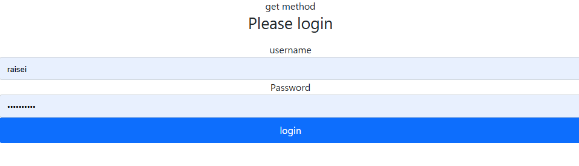
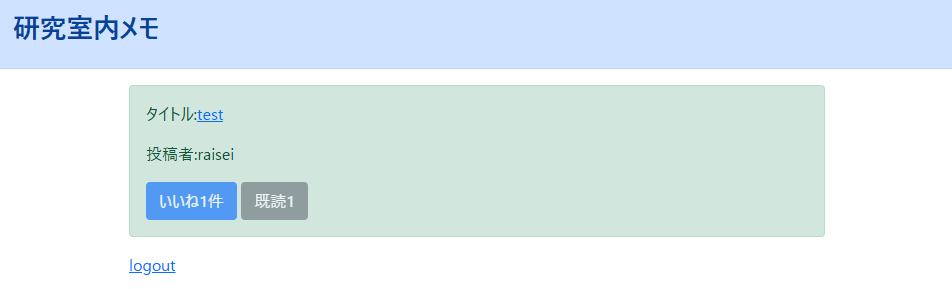
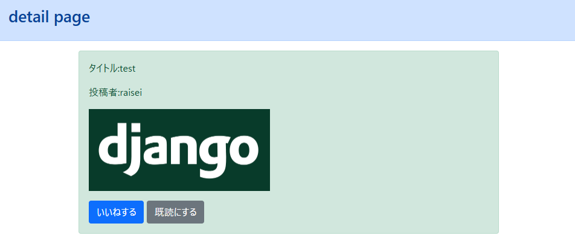

## プロジェクト概要

複数のDjangoアプリケーションを統合した学習用プロジェクトで、以下の機能を実装しています：

- **ブログアプリ（blogapp）**: 記事の投稿・閲覧機能
- **アカウント管理（accounts）**: ユーザー認証・プロフィール管理


## 制作背景

Webアプリケーション開発において、ユーザー認証機能とブログ機能を統合したプラットフォームの需要が高まっている中で、セキュアで拡張性のあるシステムを効率的に構築する必要があった。特に、複数のアプリケーション機能を統合しながらも、コードの保守性と開発効率を両立させることが求められた。

### 課題
- Django フレームワークの基本概念（MVTパターン）を体系的に学習する必要があった
- ユーザー認証システムやデータベース操作など、実際のWebアプリケーション開発で必要な機能を実装経験として積みたかった
- 単一機能だけでなく、複数のアプリケーションを統合したプロジェクト開発の経験が不足していた

### 目的
- DjangoのMVT（Model-View-Template）パターンの理解と実装
- ユーザー認証システムの構築方法の習得
- データベース設計とDjango ORMの活用
- フロントエンドとバックエンドの連携方法の学習
- 本番環境へのデプロイプロセスの理解（理論的な学習）

## 技術スタック

- **Backend**: Django
- **Database**: SQLite（開発環境）
- **Frontend**: HTML, CSS, Bootstrap
- **Python**: 3.8.10


## 技術選定およびその意図

### バックエンド: Django
**選定理由と必然性:**
- **ユーザー認証システムの要件**: 本プロジェクトではセキュアなユーザー登録・ログイン機能が必須であり、DjangoのUser認証システムは業界標準のセキュリティ機能（パスワードハッシュ化、セッション管理、CSRF保護）を標準装備している。Flask等の軽量フレームワークでは、これらを一から実装する必要があり、セキュリティリスクと開発コストが大幅に増加する
- **管理画面の必要性**: ブログアプリでは記事やユーザーの管理が不可欠で、Djangoの自動生成管理画面により開発工数を大幅削減できる。他のフレームワークでは管理画面を独自実装する必要があり、本質的でない作業に時間を割かれる
- **ORM（Object-Relational Mapping）の重要性**: 複数のアプリ間でのデータ整合性とリレーションシップ管理が必要で、Django ORMのマイグレーション機能により安全なデータベース変更が可能。生のSQLでは、スキーマ変更時のバージョン管理とデータ整合性の保証が困難

### データベース: SQLite
**選定理由と必然性:**
- **開発・学習環境の制約**: 学習用プロジェクトでは、環境構築の複雑さが学習の障壁となる。PostgreSQLやMySQLでは別途サーバーのインストールと設定が必要だが、SQLiteはファイルベースでゼロコンフィグで動作するため、学習者が本質的な部分（Django機能の理解）に集中できる
- **データ永続化の要件**: インメモリDBでは再起動時にデータが失われ、継続的な学習とテストが困難。SQLiteは永続化とトランザクション機能を提供し、学習過程でのデータ蓄積が可能
- **本番移行の容易さ**: Django ORMにより、データベースエンジンの変更時もコード変更は最小限に抑えられる。学習段階ではSQLiteで十分な機能を提供し、スケールが必要になった際の移行コストが低い

### フロントエンド: HTML, CSS, Bootstrap
**選定理由と必然性:**
- **レスポンシブデザインの必須要件**: 現代のWebアプリケーションではモバイル対応が必須で、Bootstrap のグリッドシステムとレスポンシブコンポーネントにより、CSS Media Queryを手書きするよりも遥かに効率的かつ確実にマルチデバイス対応を実現できる
- **開発速度とUIの一貫性**: ブログアプリでは複数の画面（一覧、詳細、編集等）で統一されたUIが重要で、Bootstrapの標準化されたコンポーネントにより、カスタムCSSを大量に書くことなく統一感のあるUIを構築できる
- **ブラウザ互換性の保証**: 手書きCSSでは各ブラウザでの動作検証とベンダープレフィックスの管理が膨大な作業となるが、Bootstrapは主要ブラウザでの動作が検証済みで、互換性問題のリスクを大幅に軽減できる


## 使用方法

### 1. ログイン画面

未ログイン状態で`/list`にアクセスすると、以下のログイン画面が表示されます。  
初回利用時はアカウントの作成が必要です。既存のアカウントを持っている場合は、ユーザー名とパスワードを入力してログインボタンをクリックしてください。セキュリティのため、パスワードは暗号化されて管理されています。


### 2. メモ一覧表示
ログイン後は`/login`に遷移し、メモ一覧が表示されます。  
この画面では、作成されたすべてのメモがカード形式で一覧表示されます。各メモには作成者名、タイトル、「いいね」数、「既読」数が表示されており、一目で閲覧状況などを把握できます。メモは作成日時順に並んでおり、最新のものが上部に表示されます。


### 3. メモ詳細表示
各メモをクリックすることで、詳細画面を確認できます。  
詳細画面では、メモの完全な内容を読むことができます。また、「いいね」と「既読」の機能があり、クリックすると一覧画面に表示される数字が増加します。これにより、他のユーザーとのインタラクションが可能となり、人気のメモや既読状況を共有できます。ログアウト機能も用意されており、使用後は安全にセッションを終了できます。



## セットアップ手順

### 1. リポジトリのクローン

```bash
git clone https://github.com/Raisei-Ito/Created-by-django.git
cd Created-by-django
```

### 2. 仮想環境の作成と有効化

```bash
# 仮想環境の作成
python -m venv venv

# 仮想環境の有効化
# Windows
venv\Scripts\activate
# macOS/Linux
source venv/bin/activate
```

### 3. 依存関係のインストール

```bash
# Djangoのインストール
pip install django

# その他必要なパッケージがある場合
# pip install -r requirements.txt
```

### 4. データベースのセットアップ

```bash
# マイグレーションファイルの作成
python manage.py makemigrations

# データベースにマイグレーションを適用
python manage.py migrate
```

### 5. スーパーユーザーの作成（オプション）

```bash
python manage.py createsuperuser
```

### 6. 開発サーバーの起動

```bash
python manage.py runserver
```

ブラウザで `http://127.0.0.1:8000/` にアクセスしてアプリケーションを確認できます。

## 主な機能

### ブログアプリ（blogapp）
- 記事の作成、編集、削除
- 記事の一覧表示
- 記事の詳細表示

### アカウント管理（accounts）
- ユーザー登録
- ログイン・ログアウト
- プロフィール管理

### いいね・既読機能
- いいねの数の表示、既読した人の数の表示

## 管理画面

Django管理画面にアクセスするには：

1. スーパーユーザーを作成（上記手順5参照）
2. `http://127.0.0.1:8000/admin/` にアクセス
3. 作成したスーパーユーザーでログイン


## 本番環境でのデプロイ

本番環境では以下の流れでデプロイを行うことが可能です。（今回、デプロイの実行はしていない）

- **whitenoiseを使用した静的ファイルのアップロード**  
  `whitenoise` を導入することで、Djangoアプリが静的ファイル（CSSやJS、画像など）を自身で直接配信できるようになります。
  ```bash
  pip install whitenoise
  ```
- **collectstaticを使用して、静的ファイルを一か所にまとめる**  
  `python manage.py collectstatic` を実行し、各アプリ内に散らばっている静的ファイルを `STATIC_ROOT` にまとめます。

- **Procfileの準備**  
  HerokuでDjangoを動かすために、プロジェクトのルートディレクトリに `Procfile` を作成し、以下の内容を記述します：

  ```
  web: gunicorn プロジェクト名.wsgi --log-file -
  ```
  ※ `プロジェクト名` は `manage.py` があるディレクトリ名を指定します。

- **requirements.txtの準備**  
  Herokuに必要なPythonパッケージを伝えるため、 `requirements.txt` を作成します：

- **作成したアプリをGitHubのリポジトリにアップロードする**  
  作成したDjangoアプリのコードをGitHubリポジトリにプッシュします。

- **GitHubリポジトリからHerokuでデプロイする**  
  HerokuのダッシュボードまたはCLIからGitHubリポジトリを連携させ、デプロイを実行します。

- **Heroku環境変数の設定**  
  Heroku上では `SECRET_KEY` や `DEBUG=False` などの設定を環境変数（Config Vars）として登録し、本番用の安全な設定で運用します。

## 参考資料
- [django チュートリアル](https://www.youtube.com/playlist?list=PLuCS8p0T7ozK4Ne1e5eAVG2R5Gbs1naix)
- [Django公式ドキュメント](https://docs.djangoproject.com/)

## 作成者

- GitHub: [@Raisei-Ito](https://github.com/Raisei-Ito)

## 注意事項

- このプロジェクトは学習用途として作成されています
- セキュリティ設定やパフォーマンス最適化は学習範囲に含まれていない場合があります
- 実際の開発では、より厳密なセキュリティ対策や設定が必要です
